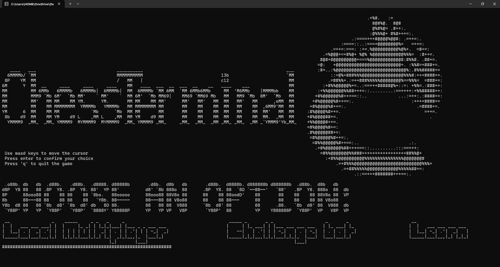
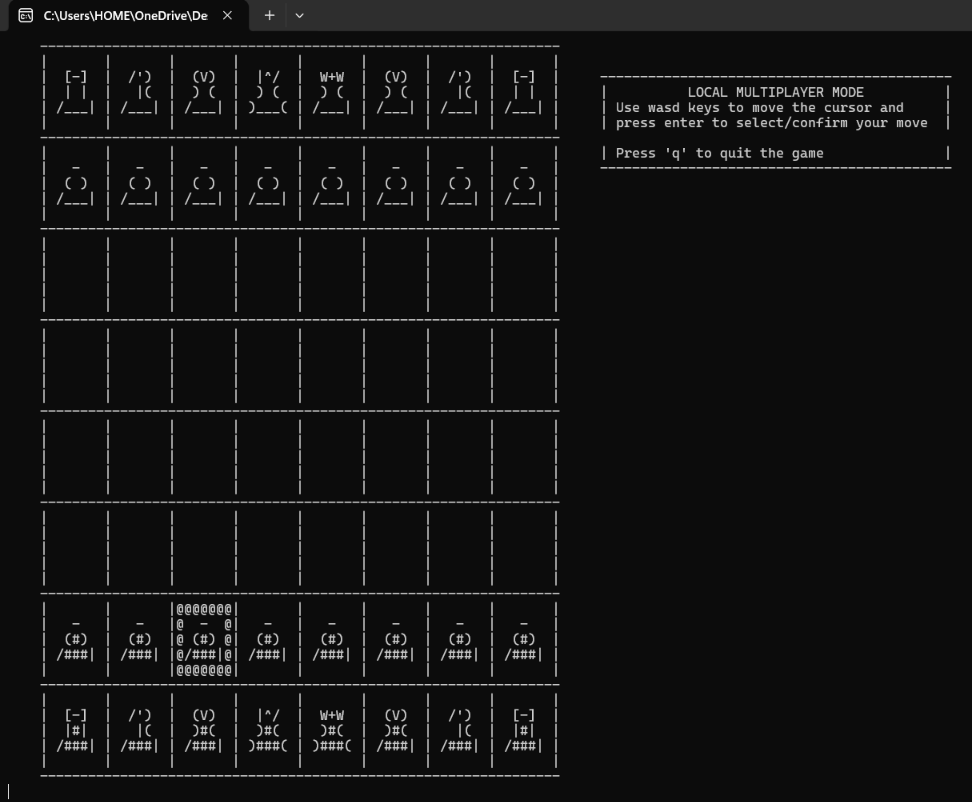
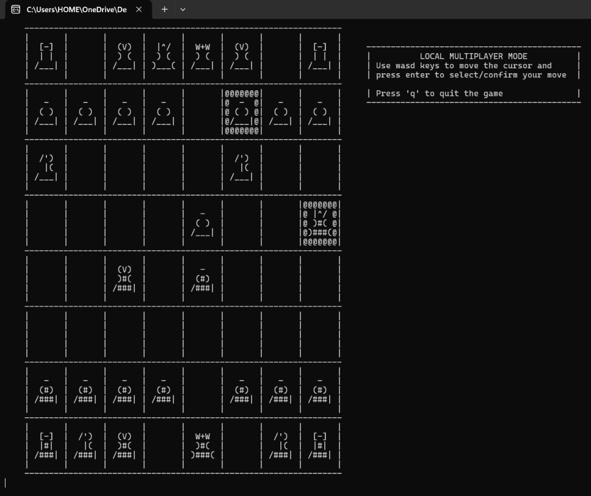
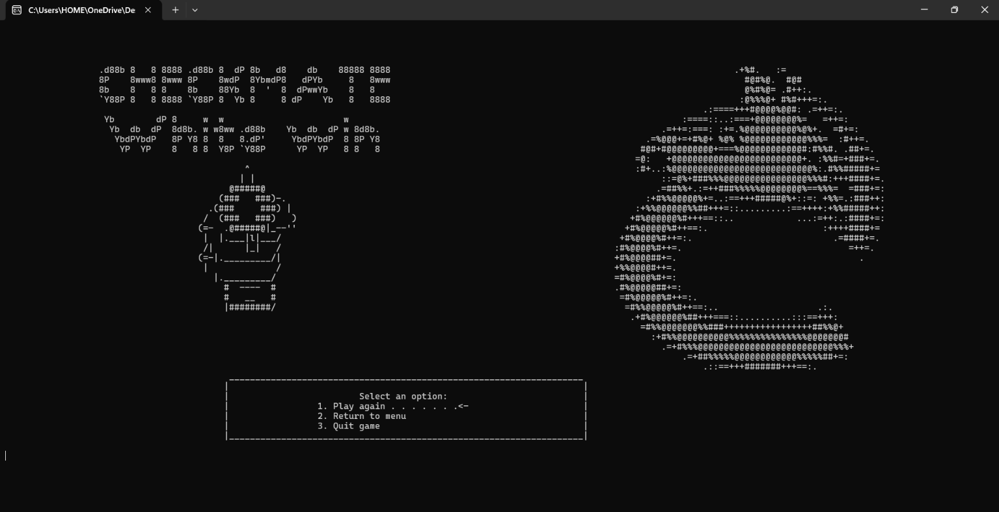

# Chess in C

A playable chessboard that runs in the terminal, written from scratch in C — no libraries, still (for now) no engine, just a `char[8][8]` board and ASCII art.

<table>
  <tr>
    <td></td>
    <td></td>
  </tr>
  <tr>
    <td></td>
    <td></td>
  </tr>
</table>

## Why

I am a first-year Computer Engineering student. The "Programming 1" course gave me the basics of C but stopped well short of a real program: lab exercises are short, self-contained and thrown away as soon as they compile. So I picked something small enough to finish and big enough to hurt — state that has to stay consistent, rules that interact, a render loop, and terminal input that does not wait for Enter.

It is a learning project, and it is written like one. The plan is three modules.

## Module 1 — Local multiplayer

Two players on the same keyboard, on a board drawn in ASCII art.

How it is built. The board is represented internally as an 8×8 matrix of characters, on top of which sits a set of functions that validate every move: whose turn it is, whether the piece can reach that square, whether the path is clear, whether the move would leave your own king in check, and whether the position is checkmate. I also tried to keep the program portable across systems — screen clearing and unbuffered keyboard input are the platform-dependent parts, and both have a Windows branch and a POSIX one.

How to use it. Build it with

```bash
gcc main.c localmp.c -Wall -Wextra -O2 -o chess    # Chess.exe on Windows
./chess
```

You need a terminal about 185 columns wide for the title screen — if the art wraps, maximise the window and shrink the font.

| Key | Action |
| --- | --- |
| `W` `A` `S` `D` | Move the cursor / change menu option |
| `Enter` | Select the piece, then the destination square |
| `Q` | Quit |

White moves first. The first `Enter` locks the origin, the second attempts the move: if it is illegal the selection is cancelled and you start again.

Not implemented yet: castling, en passant, promotion, stalemate and the drawing rules, PGN export, move history.

## Module 2 — Chess engine

An actual opponent to play against. Before writing it I have to change the way the board is represented: the 8×8 character matrix of Module 1 is easy to read and easy to print, but it is the wrong structure for a program that has to generate and evaluate thousands of positions. So the first step is understanding bitboards — the board encoded as 64-bit integers, one per piece type, where moves become bitwise operations.

The second step is the search itself: studying how alpha-beta pruning works, and what a position evaluation actually needs to take into account.

## Module 3 — Chess lessons 

Something built around teaching chess — rules, tactics, guided exercises. Still at the idea stage; I will decide the shape of it once Module 2 is running.

## Project structure

| File | Contents |
| --- | --- |
| `main.c` | Entry point, title screen, mode selector |
| `localmp.c` | Rendering, input, rules, game modes |
| `localmp.h` | Prototypes |
| `homebanner.h` | All the ASCII art and piece sprites |

## License

MIT — see [`LICENSE`](LICENSE).